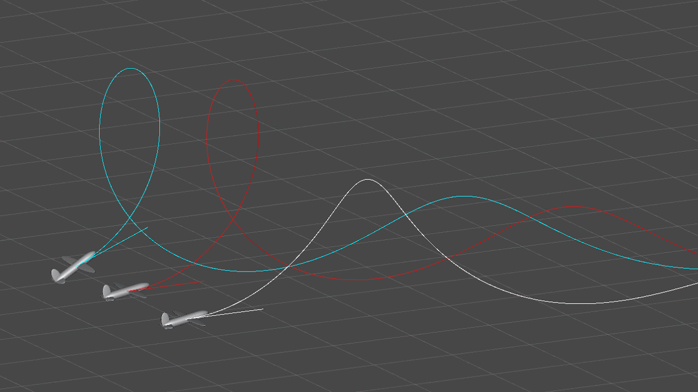

# UnityARMiniGames

## Introduction

These are some experiments I did using AR with several physically-based simulations.

### Paper airplane dynamics

Paper airplane AR game which shoots a paper airplane out of the screen in the AR scene.

The trajectory of an airplane is based on the air dynamic model 
and is controlled by initial speed, initial speed, attack angle, wingspan ratio, air density and weight of the airplane.

These parameters are mapped to smartphone camera position/orientation and swipe speed finger touch.

[Youtube Video](https://youtu.be/cxWRUij9EBA)
